## SqlServer

### 数据库的定位

- 数据库作为第四代语言，可以认为，我们输入的sql语句就是一个命令，（命令式语言）

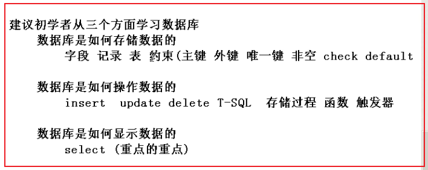

### 为什么学习数据库

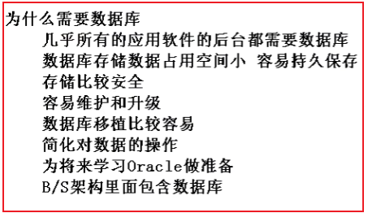

- 从某种方面来说，数据本事，比应用程序软件更加重要。也即实现某一个应用程序的技术不是很难，但是处理这个应用程序背后的数据是非常不易的。

### 不同的数据库软件

- mysql：小型数据库
- sqlserver：中型数据库
- oracle：大型数据库
- 总结：从上至下，越来越复杂，但是增加了更多的功能，它们都遵循数据库标准，只不过底层软件的实现与内部细节不同

### 数据结构与数据库的区别

- 数据库是在应用软件级别研究数据的存储和操作（外存）
- 数据结构是在系统软件级别来研究数据的存储和操作（内存）

### 什么是连接

- 数据库以另一种来存取数据的，数据存放在计算机磁盘上，本质是一个服务
- 客户端工具其实是一个软件，它不是数据可，但是我们可以通过连接，去访问本地或者远端的数据库服务，然后去操作后端的数据库
- 在客户端输入的命令，需要发送给后端数据库服务去处理。**有些命令可以集中发送给后端数据库，有些命令则不能集中发送**

### 有了编程语言为什么还需要数据库

- 堆内存数据操作是编程语言的强项，但是对硬盘数据的操作是编程语言的弱项
- 对硬盘数据操作是数据库研究的核心问题
- 一般情况二者协同工作，首先，利用编程语言调用数据库中的数据，然后通过编程语言根据业务逻辑的需要处理数据，最后把处理完的数据再次写入数据库

### 如何建立数据库

- 创建数据库对应两个文件
  - .mdf为数据文件，用来存放数据
  - .LDF为日志文件，用来记录对数据的操作，方便日后恢复数据

- 用户创建的库需要系统库来维护，系统库不用动

### 如何附加和分离数据库

- 分离：
  - 操作：右键数据库==》任务==》分离
  - 含义：当前客户端和当前数据库没有了联系
- 附加：把外部数据库文件在客户端显示
  - 把外部的数据库文件，添加到目标主机数据库相应的路径下
  - 右键数据库==》附加
- 创建登录账号
  - 登录时选项
    - windows身份验证：默认为系统的用户登录，权限较高，但移植性较差
    - sqlserver身份验证：自己创建的用户，权限较低，但移植性较高
  - 创建登录账号步骤
    - 首先，通过windows身份验证登录到数据库
    - 然后，在安全性.用户名创建用户（不勾强制密码过期）
    - 最后，就可以用创建的用户登录了

### 基本概念

- 表的结构，可以类比类来理解，表中的每一行，可以类比对象来理解，表中的每一列可以类比对象的属性

- 字段：一个事物的某一个静态的特征
- 记录：字段的组合，表示的是一个具体的事物
- 表：记录的组合，表示的是同一类型的事物的集合
- 表和字段，记录的关系
  - 字段是事物的属性
  - 记录是事物本身
  - 表是事物的集合
- 列：字段的另一种称谓
- 元组：记录的另一种称谓、

### 图形化工具建库建表

- dbo表示系统的身份，拥有最高的权限
- 先建立被依赖的表，再建立需要依赖的表
- 外键表：含有外键的表

```sql
--先创建被依赖的表
create table dept
(
	dept_id int primary key,
	dept_name nvarchar(100),
	dept_address nvarchar(100)
)

--在创建需要依赖的表
create table emp
(   --注释是两个线

	--constraint限制，依赖
	emp_id int constraint pk_emp primary key,
	
	--n 支持汉字 var 变长 nvarchar(20)支持汉字变长的最打20个字符的 
	emp_name nvarchar(20) not null,
	emp_sex nchar(1),
	
	--referencs引用
	dept_id int constraint fk_emp references dept(dept_id)
)
```


### 什么是约束

- 万物皆对象，约束也是一个对象，具有对象名

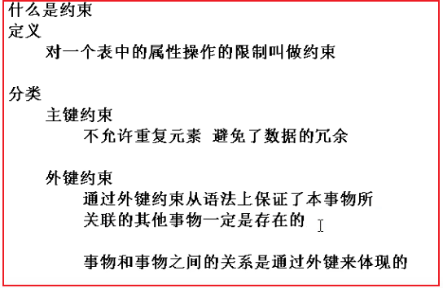

- check约束：保证事物的取值在合法的范围之内
- default约束：保证事物的属性一定有一个值，但是**在插入数据时，要指定其他的列**
- unique约束：保证了事物的属性不允许重复，但允许其中有一列且只能有一列为空
  - sqlserver的unique列不允许多行为空
  - Oracle的unique列允许多行为空
- not null：非空约束

```sql
--删除表
drop table myuser;

create table myuser
(
	--不要把业务逻辑当作主键，用代理主键代替主键
	myuser_id int primary key,
	myuser_name nvarchar(20) unique not null,
	myuser_email nvarchar(20) unique not null
)
```

### 表和约束的区别


### 什么是关系

这里的关系理解为联系，也是一张二维表

- 定义：表和表之间的联系（实体与实体之间的联系）

- 实现方式：通过设置不同形式的外键来体现表和表不同的关系（联系）

- 分类（按照联系方式的不同）（A对B）
  - 一对一
  
    - 既可以把表A的主键当表B的外键
    - 也可以把表B的主键当表A的外键
  
  - **一对多**
  
    - 把A表的主键添加到B表来充当B表的外键
    - **在多的一方添加外键**
  
  - 多对多
  
    - 多对多必须通过单独的一张表（第三张表）来表示
    - 第三张表必须含有主键和外键，且主键大多为多列属性的组合，外键通常也不唯一
  
  - ```sql
    --创建班级表
    create table grade
    (
    	grade_id int primary key,
    	grade_num int not null,
    	grade_name nvarchar(30)
    )
    --创建老师表
    create table teacher
    (
    	teacher_id int primary key,
    	teacher_name nvarchar(30)
    )
    --第三张表用来模拟老师和班级的关系
    create table grade_teacher_mapping
    (
    	grade_id int constraint fk_grade_id references grade(grade_id),
    	teacher_id int constraint fk_teacher_id references teacher(teacher_id),
    	constraint pk_grade_teacher primary key (grade_id, teacher_id)
    )
    ```
  

### 什么是主键

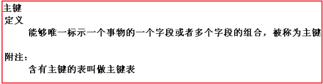

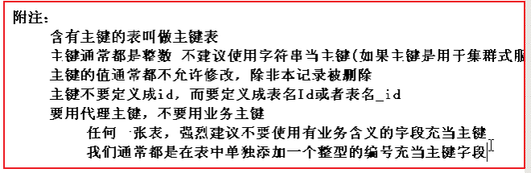

### 什么是外键

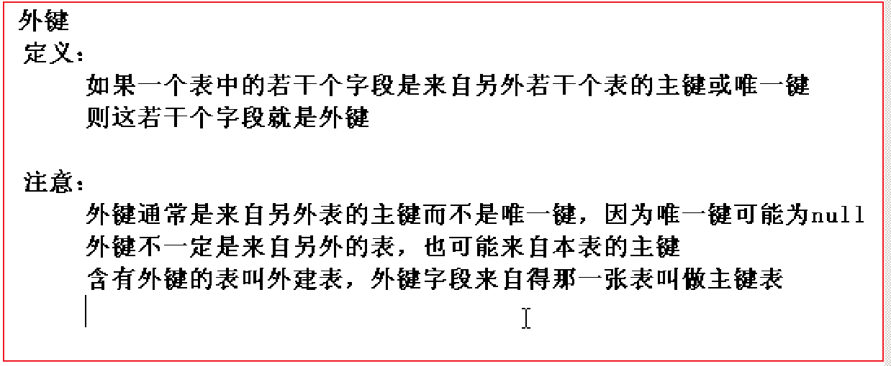


### 查询

查询最重要的是顺序

#### 计算列

```sql
-- 查询一个表中的所有信息
select * from emp;

-- 为查询的结果起别名，用as as可以省略
-- 别名建议用双引号引起来
select ename, EMPNO, sal *12 as "年薪" from emp;

--结果为和emp相同行数的888
select 888 from emp;

-- 结果为一行的5
select 5;
```

- 为字段起别名用双引号 as可以省略

#### distinct

```sql
--消除重复的deptno
select distinct deptno from emp;

-- 以deptno和comm的组合来判断是否被消除重复的行
select distinct deptno, comm from emp;

-- 多行为null也只会输出一个
select distinct comm from emp;

--这样写会出错，行数可能不匹配
--select deptno, distinct comm from emp;
```

#### between

在某个范围之间（包含两个端点）

```sql
select * from emp
	where  sal=5000;
-- 两个等价
select * from emp
	where sal>=1500 and sal<=3000;

select *from emp
	where sal between 1500 and 3000;

select * from emp
	where sal<1500 or sal>3000;

select * from emp
	where sal not between 1500 and 3000;
```

#### in

属于若干个孤立的值

```sql
select * from emp
	where sal=1500 or sal=3000 or sal=5000;
-- 等价于
select * from emp
	where sal in (1500, 3000, 5000);

-- not in
select * from emp
	where sal not in (1500, 3000, 5000);
-- 等价于
select * from emp
	where sal<>1500 and sal<>3000 and sal<>5000;
-- 虽然不等于号可以!=这样写，但是建议这样写<>
```

- 建议不等于号<>这样写

#### top

```sql
select top 5 * from emp;

-- 当有小数时，向上取整
select top 5 percent * from emp;

-- 查询工资在1500到3000之间（包括1500到3000）
-- 的员工中最高工资对的前四个
select top 4 * from emp
	where sal between 1500 and 3000
	order by sal desc;
```

- 输出前几个，当有小数时向上取整
- 后面分页查询可能会用到

#### null

没有值，空值

```sql
-- 查询奖金为空的员工的信息
select * from emp
	where comm is null;

-- 查询奖金不为空的员工的信息
select * from emp
	where comm  is not null;

-- 查询所有员工的年薪
-- select ename, sal * 12 +comm as "年薪" from emp;错误写法
select ename, sal * 12 + ISNULL(comm, 0) as "年薪" from emp;
```

- 0和空值是不一样的，null表示空值，没有值，0表示一个确定的值
- null不能参与如下运算: <> != =
- null可以参与如下运算：is not is
- null不能参与数据运算，否则结果为空
- ISNULL函数，如果为空，返回第二个指定的值，否则返回第一个参数的值

#### order by

以某个字段排序

```sql
select * from emp order by sal; -- 默认位升序排序
select * from emp order by sal asc; --asc 表示升序排序
select * from emp order by sal desc ;--desc 表示降序排序

-- 先以第一字段排序，第一字段相同再按第二字段排序，不指定默认为升序
select * from emp order by deptno desc, sal; 
```

#### 模糊查询

```sql
-- 查询名字含有A的员工的所有信息

-- % 表示任意多个字符（0个或者多个）
select * from emp 
	where ename like '%A%';
select * from

-- - 表示任意的单个字符
select * from emp 
	where ename like '__A%';
	
-- [a-f] 表示a到f的之间的单个字母（不区分大小写）
select * from emp 
	where ename like '_[a-f]A%';
-- [a,b,c] 表示或，单个字符
-- [^a-z] ^表示取反

-- 通配符的转义
select * from student
	where name like '%\%%' escape '\';
	
select * from student
	where name like '_\_%' escape '\';
```

- 主要要用单引号

#### 聚合函数

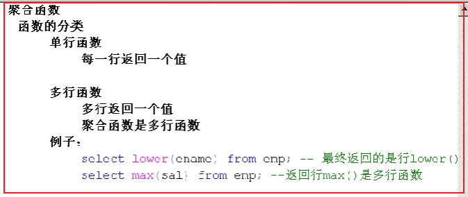

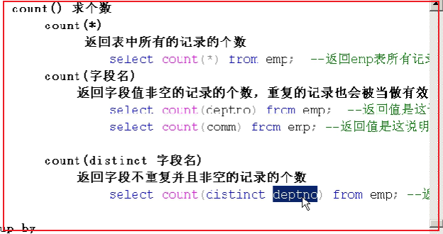

```sql
-- 都是多行函数，最终返回一个值，不矛盾
select max(sal) as "最高工资", min(sal) as "最低工资", count(*) as "员工个数" from emp;

-- 有单行函数，有多行函数，矛盾
select max(sal), lower(ename) from emp;
```

- 单行函数，针对某一行，一行一行的处理，返回多行
- 多行函数，针对多行一起处理，返回一个值
- 函数本能的反应就是括号

#### grunp by

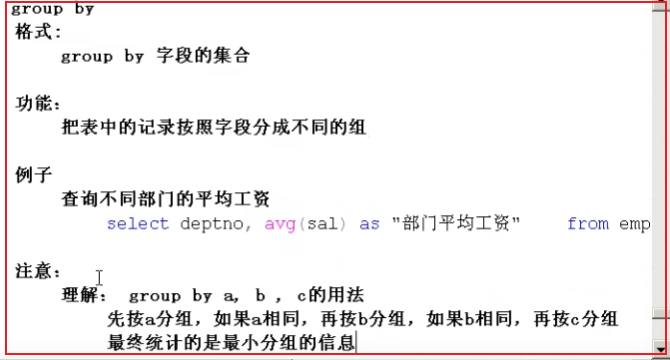

```sql
-- 以一个字段分组
select deptno, AVG(sal) as '部门平均工资'
	from emp
	group by deptno;

-- 以多个字段分组
select deptno, job, AVG(sal) as '平均工资'
	from emp
	group by deptno, job
	order by deptno;
```

- 分组之后，将会以这个组作为一个整体进行处理
- 分组查询：以谁分组，那么查询的字段就写谁
- 分组查询常常和聚合函数一起使用，达到统计数据的目的

#### having

分组后的条件判断

```sql
select deptno, avg(sal) as '平均工资'
	from emp
	group by deptno
	having avg(sal) > 2000;
```

- having就是对分组后再进行条件的筛选，having后面的字段和grounp后面所要求的字段一致

```sql
-- 查询名字不含A，然后以deptno分组后的所有部门编号和平均工资
select deptno, avg(sal) as '平均工资'
	from emp
	where ename not like '%A%'
	group by deptno
	having avg(sal) > 2000;
```

- where是分组前的条件判断，且where不能和聚合函数一起使用
- having是分组后的条件判断，having一般要和聚合函数一起使用

#### 连接查询

将两个表或者两个以上的表一一定的连接条件连接起来从中检索出满足条件的数据

##### 内连接

- 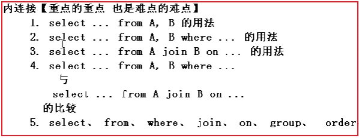

  ```sql
  -- 1. select ... from A, B （笛卡尔积）
  -- a表中的所有行，连接B表中的每一行
  -- 相当于无条件的连接
  select * from emp, dept;
  
  -- 2.select ... from A, B where（在笛卡尔积上筛选）
  select * 
  	from emp, dept
  	where empno = 7369;
  	
  -- 3.select ... from A join B on ...（结果的列数为和含有外键的那个表写的列数相同）
  select * 
  	from emp "E"
  	join dept "D" -- join连接
  	on  "E".deptno = "D".deptno
  
  
  select "D".deptno as "部门编号", "E".sal as "员工工资"
  	from dept "D"
  	join emp "E"
  	on "D".deptno = "E".deptno; 
  	
  -- 4.不同的连接查询标准
  
  -- 92标准
  select *
  	from emp,dept
  	where dept.deptno = emp.deptno;
  
  -- 99标准（推荐使用）
  select * from emp
  	join dept
  	on emp.deptno = dept.deptno;
  	
  -- 5. 例子
  select * 
  	from emp "E"
  	join dept "D"
  	on "E".deptno = "D".deptno
  	where "E".sal > 2000;
  
  select *
  	from emp, dept
  	where emp.deptno = dept.deptno and emp.sal > 1200;
  	
  -- 6.三个表查询
  select *
  	from emp "E"
  	join dept "D"
  	on "E".deptno = "D".deptno
  	join SALGRADE "S"
  	on "E".sal between "S".LOSAL and "S".HISAL
  	-- on "E".sal >= "S".LOSAL and "E".sal <= "S".HISAL
  	where "E".sal > 2000;
  -- 7.习题
  -- 1. 求出每个员工的姓名，部门编号，薪水和薪水的等级
  select "E".ename as "姓名", "D".deptno as "部门编号"
  , "E".sal as "薪水", "S".GRADE as "薪水等级"
  	from emp "E"
  	join dept "D"
  	on "E".deptno = "D".deptno
  	join SALGRADE "S"
  	on "E".sal between "S".LOSAL and "S".HISAL;
  -- 2. 查找每个部门的编号，该部门所有员工的平均工资，平均工资的等级
  select "T".deptno, "T".平均工资, "S".GRADE 
  	from(
  		select deptno, avg(sal) as "平均工资"
  			from emp
  			group by emp.deptno
  	) "T"
  	join SALGRADE "S"
  	on "T".平均工资 between "S".LOSAL and "S".HISAL;
  -- 3. 在2的基础上加上部门名称
  select "T".deptno, "T".平均工资, "S".GRADE, "D".dname as "部门名称"
  	from(
  		select deptno, avg(sal) as "平均工资"
  			from emp
  			group by emp.deptno
  	) "T"
  	join SALGRADE "S"
  	on "T".平均工资 between "S".LOSAL and "S".HISAL
  	join dept "D"
  	on "T".deptno = "D".deptno;
  -- 4. 求出emp表中所有领导的姓名
  
  -- 这种方式复杂并且有弊端
  select distinct "E2".ename
  	from emp "E1"
  	join emp "E2"
  	on "E1".mgr = "E2".EMPNO;
  -- not和in连用可能会出错
  select *
  	from emp
  	where empno in (select mgr from emp);
  -- 5. 求出平均薪水最高的部门的编号和部门的平均工资
  select top(1) deptno, avg(sal) from emp
  	group by emp.deptno
  	order by AVG(sal) desc;
  
  -- 6. 把工资大于所有员工中工资最低的人中的前3个人的姓名，工资，部门编号，部门名称，工资等级输出
  -- 翻译，有一个人工资最低，把这个人排除掉，剩下的人中工资最低的前3个人的，，，
  select top 3 *
  	from(
  		select * from  emp 
  			where sal > (select min (sal) from emp)
  	) "T"
  	join dept "D"
  	on "T".deptno = "D".deptno
  	join SALGRADE "S"
  	on "T".sal between "S".LOSAL and "S".HISAL
  	order by "T".sal asc;
  ```
  
  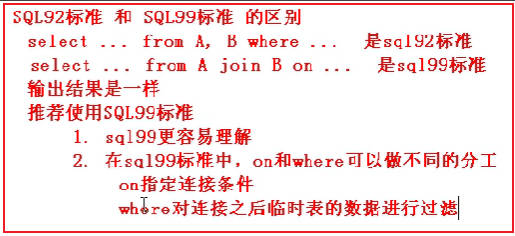
  
  - 连接查询一般要为表起一个别名（用双引号）
  - 等值连接查询结果的行数，取决于含有外键的那张表
  - 查询的结果也可以作为一张表和其他表进行连接
  - 上面有的例子是嵌套查询，都是不相关子查询
- 哪个表写在前面，那么相应的结果也在前面

### 经验之谈

- **设计一个表必须有主键，主键不能为空**
  - 主键唯一标识一个事物，避免数据冗余
- 外键：两个表之间联系的桥梁，体现事物与事物的关系
- 在实际建表中，无论主键是什么，我们一般都再增加一列序号作为该关系的主键，来标识该实体，该序号可能没有实际意义
  - **不要用有实际意义的属性当主键，一般再增加一列没有实际意义的序号作为该关系的主键**（不要用业务逻辑当主键，用代理主键当主键）
  - 将原本具有实际意义的主键/不允许重复的键（一般为单个属性）当作唯一键
- 关系与关系的联系，通过外键来互通  外键<==>来自
- **单引号表示字符串，双引号表示对象的名字**