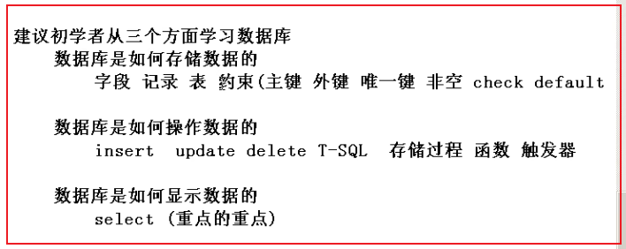
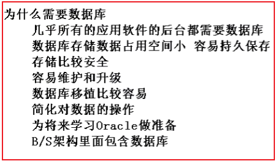
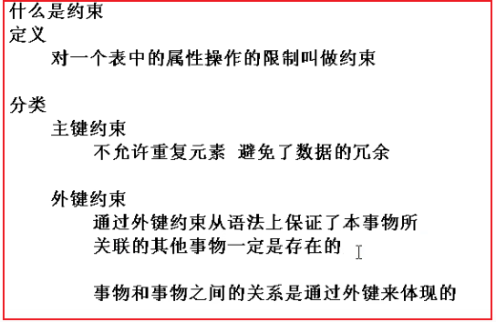

## SqlServer

### 数据库的定位

- 数据库作为第四代语言，可以认为，我们输入的sql语句就是一个命令，（命令式语言）



### 为什么学习数据库



- 从某种方面来说，数据本事，比应用程序软件更加重要。也即实现某一个应用程序的技术不是很难，但是处理这个应用程序背后的数据是非常不易的。

### 不同的数据库软件

- mysql：小型数据库
- sqlserver：中型数据库
- oracle：大型数据库
- 总结：从上至下，越来越复杂，但是增加了更多的功能，它们都遵循数据库标准，只不过底层软件的实现与内部细节不同

### 数据结构与数据库的区别

- 数据库是在应用软件级别研究数据的存储和操作（外存）
- 数据结构是在系统软件级别来研究数据的存储和操作（内存）

### 什么是连接

- 数据库以另一种来存取数据的，数据存放在计算机磁盘上，本质是一个服务
- 客户端工具其实是一个软件，它不是数据可，但是我们可以通过连接，去访问本地或者远端的数据库服务，然后去操作后端的数据库
- 在客户端输入的命令，需要发送给后端数据库服务去处理。**有些命令可以集中发送给后端数据库，有些命令则不能集中发送**

### 有了编程语言为什么还需要数据库

- 堆内存数据操作是编程语言的强项，但是对硬盘数据的操作是编程语言的弱项
- 对硬盘数据操作是数据库研究的核心问题
- 一般情况二者协同工作，首先，利用编程语言调用数据库中的数据，然后通过编程语言根据业务逻辑的需要处理数据，最后把处理完的数据再次写入数据库

### 如何建立数据库

- 创建数据库对应两个文件
  - .mdf为数据文件，用来存放数据
  - .LDF为日志文件，用来记录对数据的操作，方便日后恢复数据

- 用户创建的库需要系统库来维护，系统库不用动

### 如何附加和分离数据库

- 分离：
  - 操作：右键数据库==》任务==》分离
  - 含义：当前客户端和当前数据库没有了联系
- 附加：把外部数据库文件在客户端显示
  - 把外部的数据库文件，添加到目标主机数据库相应的路径下
  - 右键数据库==》附加
- 创建登录账号
  - 登录时选项
    - windows身份验证：默认为系统的用户登录，权限较高，但移植性较差
    - sqlserver身份验证：自己创建的用户，权限较低，但移植性较高
  - 创建登录账号步骤
    - 首先，通过windows身份验证登录到数据库
    - 然后，在安全性.用户名创建用户（不勾强制密码过期）
    - 最后，就可以用创建的用户登录了

### 基本概念

- 表的结构，可以类比类来理解，表中的每一行，可以类比对象来理解，表中的每一列可以类比对象的属性

- 字段：一个事物的某一个静态的特征
- 记录：字段的组合，表示的是一个具体的事物
- 表：记录的组合，表示的是同一类型的事物的集合
- 表和字段，记录的关系
  - 字段是事物的属性
  - 记录是事物本身
  - 表是事物的集合
- 列：字段的另一种称谓
- 元组：记录的另一种称谓、

### 图形化工具建库建表

- dbo表示系统的身份，拥有最高的权限
- 先建立被依赖的表，再建立需要依赖的表
- 外键表：含有外键的表

```sql
--先创建被依赖的表
create table dept
(
	dept_id int primary key,
	dept_name nvarchar(100),
	dept_address nvarchar(100)
)

--在创建需要依赖的表
create table emp
(   --注释是两个线

	--constraint限制，依赖
	emp_id int constraint pk_emp primary key,
	
	--n 支持汉字 var 变长 nvarchar(20)支持汉字变长的最打20个字符的 
	emp_name nvarchar(20) not null,
	emp_sex nchar(1),
	
	--referencs引用
	dept_id int constraint fk_emp references dept(dept_id)
)
```


### 什么是约束

- 万物皆对象，约束也是一个对象，具有对象名



- check约束：保证事物的取值在合法的范围之内
- default约束：保证事物的属性一定有一个值，但是**在插入数据时，要指定其他的列**
- unique约束：保证了事物的属性不允许重复，但允许其中有一列且只能有一列为空
  - sqlserver的unique列不允许多行为空
  - Oracle的unique列允许多行为空
- not null：非空约束

```sql
--删除表
drop table myuser;

create table myuser
(
	--不要把业务逻辑当作主键，用代理主键代替主键
	myuser_id int primary key,
	myuser_name nvarchar(20) unique not null,
	myuser_email nvarchar(20) unique not null
)
```

### 表和约束的区别


### 经验之谈

- **设计一个表必须有主键，主键不能为空**
  - 主键唯一标识一个事物，避免数据冗余
- 外键：两个表之间联系的桥梁，体现事物与事物的关系
- 在实际建表中，无论主键是什么，我们一般都再增加一列序号作为该关系的主键，来标识该实体，该序号可能没有实际意义
  - **不要用有实际意义的属性当主键，一般再增加一列没有实际意义的序号作为该关系的主键**（不要用业务逻辑当主键，用代理主键当主键）
  - 将原本具有实际意义的主键/不允许重复的键（一般为单个属性）当作唯一键
- 关系与关系的联系，通过外键来互通  外键<==>来自
- 单引号表示字符串，双引号表示对象的名字